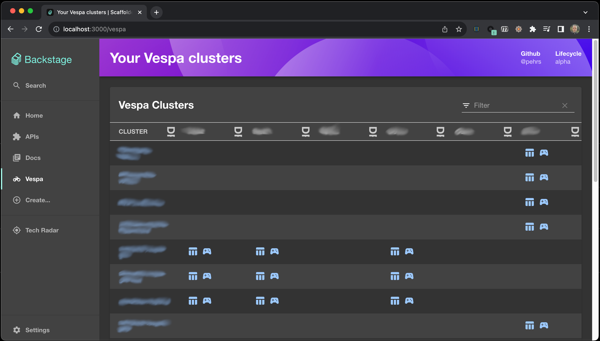
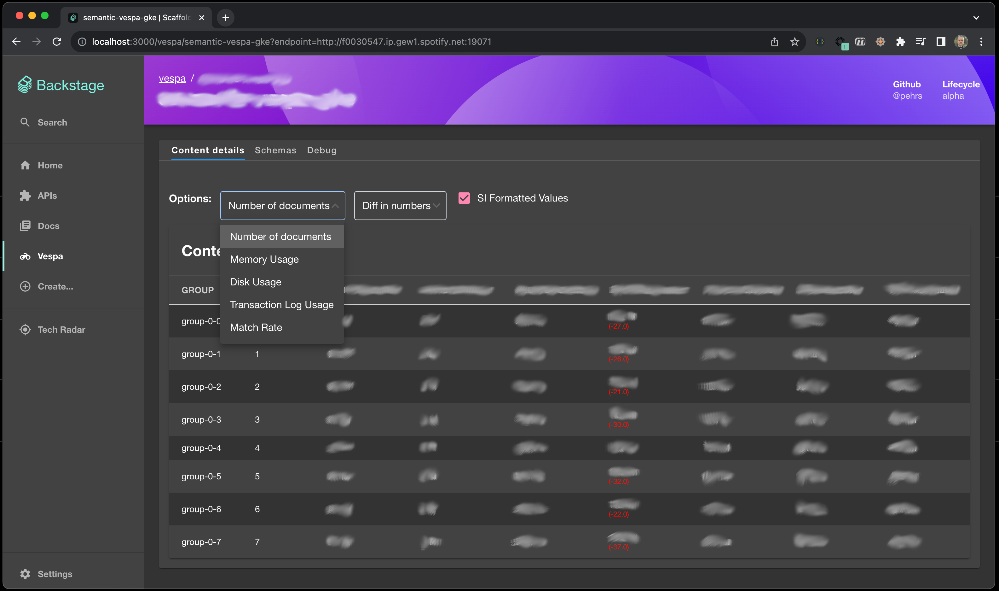
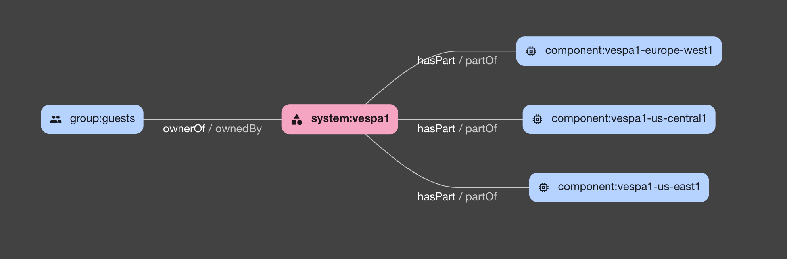

# backstage-vespa-plugin

Welcome to the vespa [backstage](https://backstage.io/) plugin!

The target of these plugins are organizations that run multiple [Vespa](https://github.com/vespa-engine/vespa) clusters (in multiple regions) and want to quicky have an overview of their status.

This is a combination of 2 plugins (the [frontend](./plugins/vespa/README.md) and the [backend](./plugins/vespa-backend/README.md)) that will give an overview of your Vespa clusters.


Example screenshot: showing 14 vespa clusters in 6 regions.


Example screenshot: showing cluster content details.

## Installation

Make sure you have created a [backstage-app](https://backstage.io/docs/getting-started/#create-your-backstage-app) first, then:

### To install these plugins run:

   Yarn: (FIXME: This is still untested and I do not know how to publish the plugins yet)
   
   ```bash
   # From your Backstage app root directory
   cd /the/root/of/your/backstage/app
   yarn add --cwd packages/app @pehrs/backstage-vespa-backend
   yarn add --cwd packages/app @pehrs/backstage-vespa
   ```
   
   Alternatively, clone this repo and copy the plugins into place:
   ```bash
   cd /some/tmp/path
   git clone git@github.com:pehrs/backstage-vespa-plugin.git
   cd /the/root/of/your/backstage/app
   cp -r /some/tmp/path/backstage-vespa-plugin/plugins/vespa \
      ./plugins/.
   cp -r /some/tmp/path/backstage-vespa-plugin/plugins/vespa-backend \
      ./plugins/.
   ```

### Integrate plugin with backstage-app

   *  Add to [`packages/backend/package.json`](packages/backend/package.json):

      ```tsx
	  "@pehrs/plugin-vespa-backend": "^0.1.0",
      ```

   *  Add to [`packages/backend/src/index.ts`](packages/backend/src/index.ts):

      ```tsx
      import vespa from './plugins/vespa';
      ...
      const vespaEnv = useHotMemoize(module, () => createEnv('vespa'));
      ... 
      apiRouter.use('/vespa', await vespa(vespaEnv));
      ```

   *  Add the file [`packages/backend/src/plugins/vespa.ts`](packages/backend/src/plugins/vespa.ts):
      ```tsx
      import { createRouter } from '@pehrs/plugin-vespa-backend';
      import { Router } from 'express';
      import { PluginEnvironment } from '../types';
      import { CatalogClient } from '@backstage/catalog-client';

      export default async function createPlugin(
         env: PluginEnvironment,
      ): Promise<Router> {
         const catalogApi = new CatalogClient({ discoveryApi: env.discovery });
         return await createRouter({
            logger: env.logger,
            config: env.config,
            catalogApi,
         });
      }
	  ```

   *  Add to [`packages/app/package.json`](packages/app/package.json):

      ```tsx
      "@pehrs/plugin-vespa": "^0.1.0",
      ```

   *  Add to [`packages/app/src/App.tsx`](packages/app/src/App.tsx):

      ```tsx
      import { VespaPage, VespaDetailsPage } from '@pehrs/plugin-vespa';
      ...
      <Route path="/vespa" element={<VespaPage />} />
      <Route
         path="/vespa/:clusterName"
         element={<VespaDetailsPage />}
      />
      ```

   *  [OPTIONAL] Add to [`packages/app/src/components/Root/Root.tsx`](packages/app/src/components/Root/Root.tsx):
      ```tsx
	  // In later versions of material-ui there is ACTUAL Vespa icon :-)
      import Vespa from '@material-ui/icons/Motorcycle';
	  ...
      <SidebarItem icon={Vespa} to="vespa" text="Vespa" />
      ```


### Configure the plugins

In order for the vespa plugins to work you need to add your vespa 
clusters as services and components into the backstage catalog.
   
For now you have to organize your clusters within a "system"


   

The vespa cluster component system will become one line in the vespa plugin list of clusters.

The plugins use tags, labels and links defined for your components to figure out what are vespa clusters:
   
   * `tags`
   
     `vespa` - this indicates that the component is a vespa cluster
   
   * `labels`
   
     `vespa-plugin/regions` - Indicates which regions the clusters are located in. 
	 Each region (from all clusters) will become one column in the vespa overview (see above).

     `vespa-plugin/endpoint` - The url pattern to the config master node.
	 The `vespa-plugin/endpoint` value can be either a http or srv (dns) pattern (see example below).
	 The variable `{region}` will be substitued from the `vespa-plugin/regions` label.

     `vespa-plugin/query-endpoint` - The url pattern to the query nodes.
	 
Here's an example of a system and component:
```yaml
---
apiVersion: backstage.io/v1alpha1
kind: System
metadata:
  name: vespa-clusters
  description: Vespa Clusters
spec:
  owner: guests

---
# https://backstage.io/docs/features/software-catalog/descriptor-format#kind-component
apiVersion: backstage.io/v1alpha1
kind: Component
metadata:
  name: vespa-cluster1
  description: Vespa cluster in several regions
  label:
    - vespa-plugin/regions: "eu-west1,eu-east2,us-central1"
    - vespa-plugin/endpoint: "srv:_vespa-cluster1-config._http.services.{region}.my-domain.net"
    - vespa-plugin/query-endpoint: "srv:_vespa-cluster1-query._http.services.{region}.my-domain.net"
  tags:
    - vespa
spec:
  type: service
  lifecycle: experimental
  owner: guests
  system: vespa-clusters


---
# https://backstage.io/docs/features/software-catalog/descriptor-format#kind-component
apiVersion: backstage.io/v1alpha1
kind: Component
metadata:
  name: vespa-cluster2-us-central1
  description: Single vespa cluster
  label:
    - vespa-plugin/regions: "us-central1"
    - vespa-plugin/endpoint: "http://vespa-cluster2-config.us-central1.my-domain.net.:19071"
    - vespa-plugin/query-endpoint: "http://vespa-cluster2-query.us-central1.my-domain.net.:8080"
  tags:
    - vespa
spec:
  type: service
  lifecycle: experimental
  owner: guests
  system: vespa-clusters

```

Take a look at the [examples/vespa-clusters.yaml](examples/vespa-clusters.yaml) for a example.


## Developer notes

To start the app, run:

```sh
yarn install
yarn dev
```

```shell
# Add plugin (vespa)
yarn new --select plugin
# Add backend plugin (Remember to use the name "vespa")
yarn new --select backend-plugin

```
